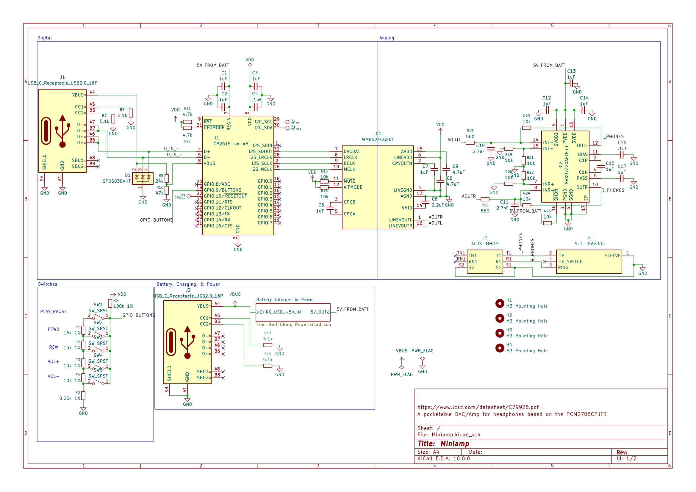
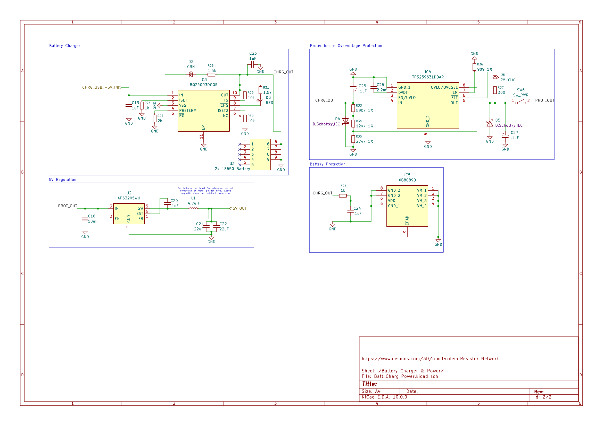
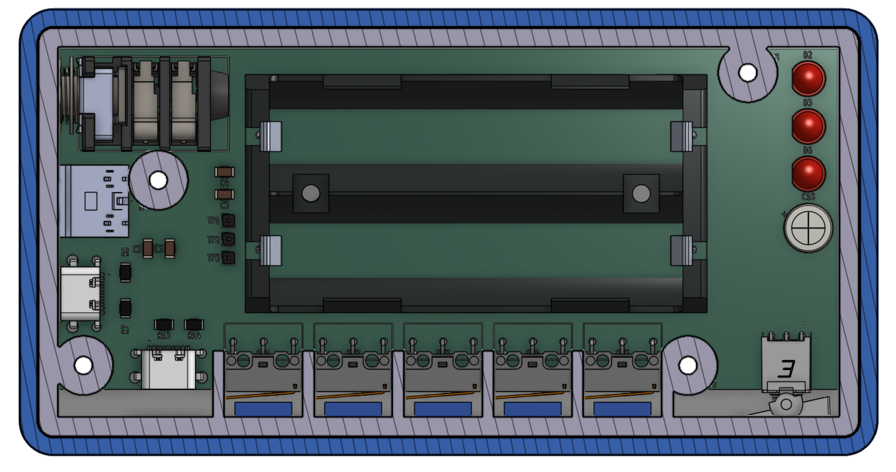
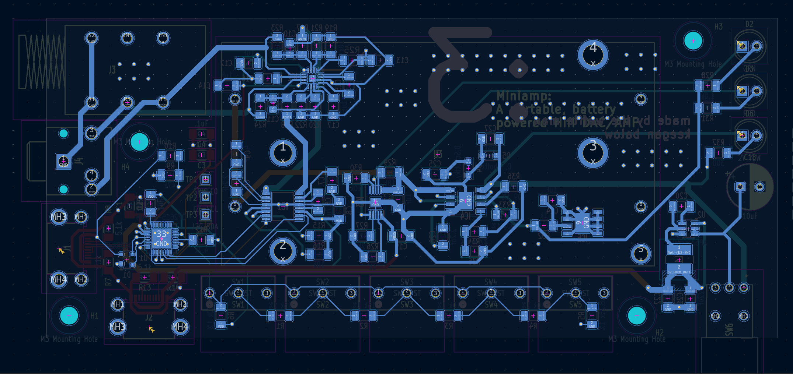
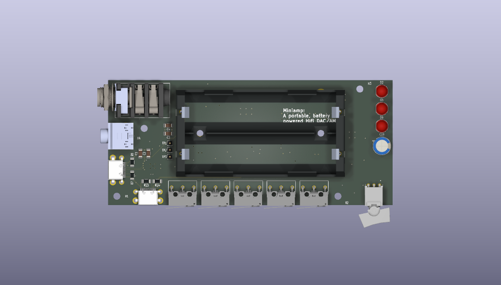
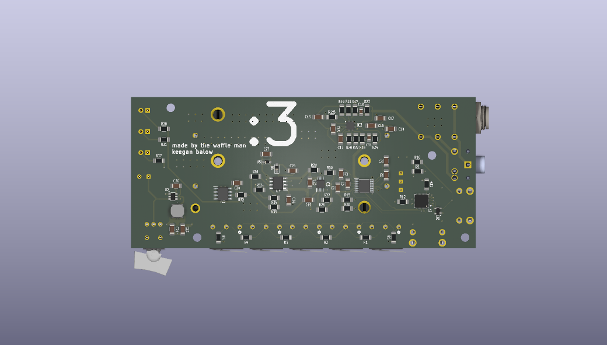

# Miniamp
A portable, battery powered Hi-Fi DAC and headphone amplifier.

## Shortcuts
- [Features](#features)
- [What is it?](#what-is-it)
- [Resources](#resources)
- [Assembly](#assembly)
- [Bill Of Materials](#bill-of-materials)
- [Photos](#photos)

## Miniamp Zine

## Features

- Independent USB-C Ports
  - Top Mounted Data Only USB-C
  - Side Mounted Power Only USB-C
- Variable Size Audio Outputs
  - 1/4"
  - 3.5mm
- 5 Physical Media Control Buttons
- Toggleable Power Switch
- 2 Integrated 18650 Batteries
  - Avoids Discharging Connected Device (e.g., Mobile Phone, Laptop)
- Small Form Factor

## What is it?

Miniamp is a portable, battery powered DAC and headphone amp designed for phones, portable devices, or for desk deployments. The Miniamp features a Hifi DAC chip capable of producing 24bit 44.1kHz outputs at 2.1Vrms, with adequite power for majority of headphones. It utilizes a Silicon Labs CP2615-A02-GM USB to I2S chip, a Cirrus Logic WM8524CGEDT DAC, and an Analog Devices MAX97220AETE+T headphone amplifier. It also has a battery charging and protection circuit to handle charing, protection, and output regulation to the ICs using 2 18650 batteries in a 1s2p configuration. This setup removes power draw from the data streaming device and offloads it to the batteries, with a passthrough power circuit to power all devices externally with a long battery life.
 
## Resources

CAD Link: https://cad.onshape.com/documents/a14a9a55c78bf32f82e1c97a/w/0351478092a46614c60a771f/e/1fa4c67b30b50298fb86e419?renderMode=0&uiState=6a336e0a197a1dd98d81aa96

CAD Files: [HERE](/3DModels)

ECAD Files: [HERE](/Models/ECADModels_Production/)

Production Files: [HERE](/Resources/)

## Assembly

You will need:
- PCB (PCBA with ICs attached if you do not have a way to solder smd parts without legs, the assumed method of this assembly guide)
- Rest of ICS needed
- Required Heatset Inserts
- All printed parts
- Soldering iron
- Solder
- Matching screwdriver to screw set (allen key in provided kit)
- Small pair of tweasers

## Bill Of Materials

BOM: [HERE](https://docs.google.com/spreadsheets/d/1Rq9yz0U521aMRGwPaQNTlH2bsf_DakTQIQjvENSfLP8/edit?usp=sharing)

PCBA BOM: [HERE](https://docs.google.com/spreadsheets/d/17-cePCVTrSii_cqeCaBxXgTqAQEytrTk/edit?usp=sharing&ouid=108713575531525219545&rtpof=true&sd=true)

## Photos

Miniamp Main PCB Schematic

Miniamp Power PCB Schematic

Miniamp Case Front

Miniamp Case Back

Miniamp Case Inside

PCB All Layers

PCB F.Cu Layer

PCB In1.Cu Layer

PCB In2.Cu Layer

PCB In3.Cu Layer

PCB In4.Cu Layer

PCB B.Cu Layer

Top of PCB

Bottom of PCB

## Credits

This project uses:

- [KiCad](https://www.kicad.org/)
- [Figma](https://www.figma.com/)
- [Hack Club Fallout](https://fallout.hackclub.com/path)