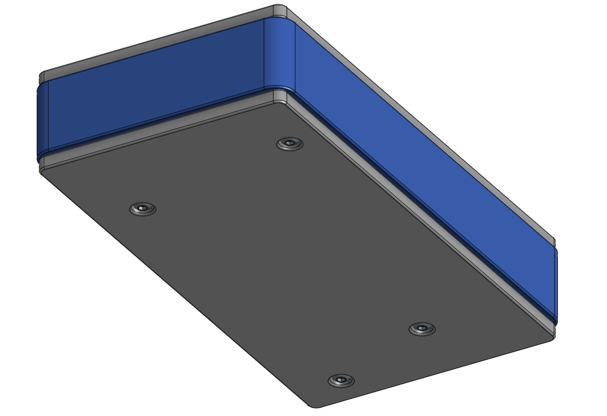
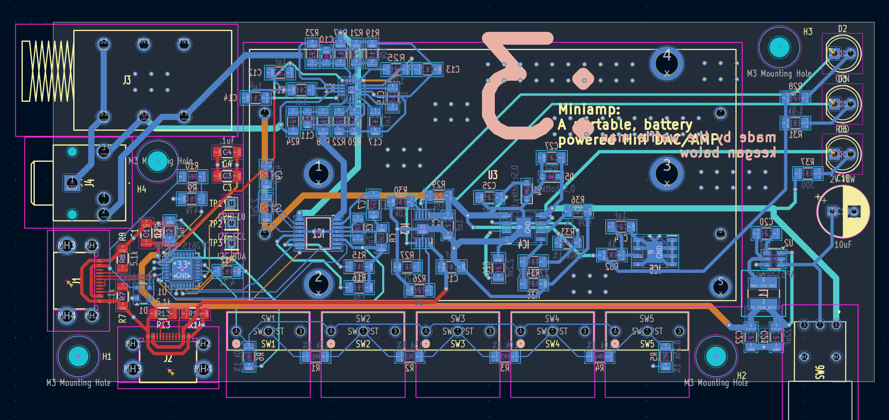
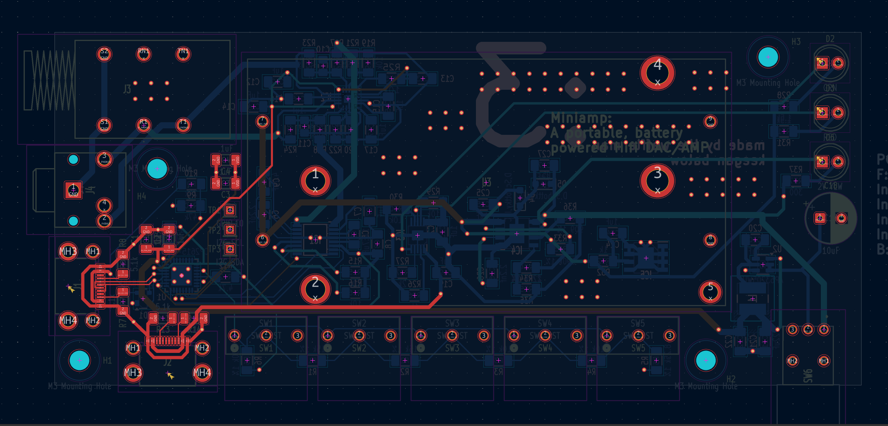
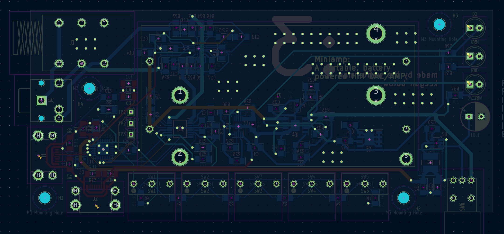
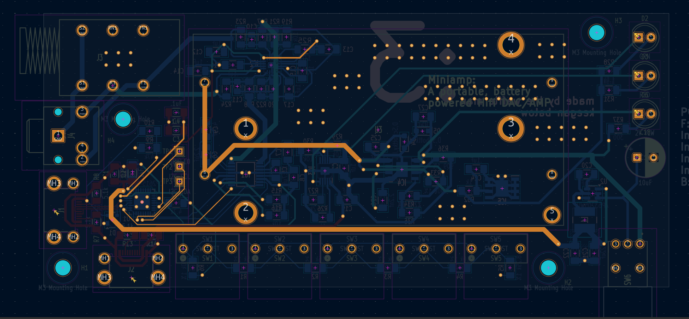
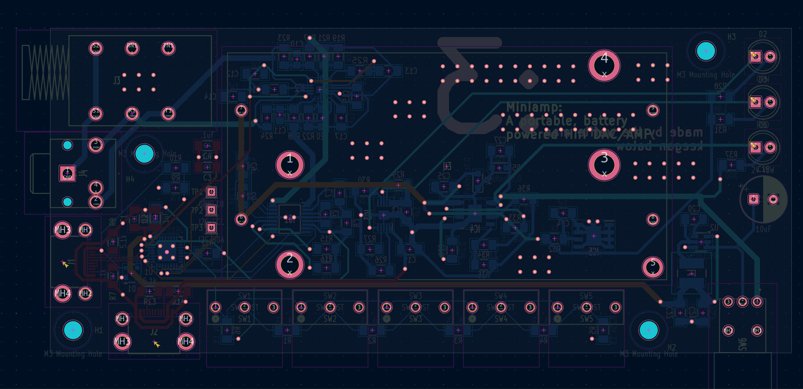

# Miniamp
A portable, battery powered Hi-Fi DAC and headphone amplifier.

## Shortcuts
- [Features](#features)
- [What is it?](#what-is-it)
- [Resources](#resources)
- [Assembly](#assembly)
- [Bill Of Materials](#bill-of-materials)
- [Photos](#photos)

## Miniamp Zine

## Features

- Independent USB-C Ports
  - Top Mounted Data Only USB-C
  - Side Mounted Power Only USB-C
- Variable Size Audio Outputs
  - 1/4"
  - 3.5mm
- 5 Physical Media Control Buttons
- Toggleable Power Switch
- 2 Integrated 18650 Batteries
  - Avoids Discharging Connected Device (e.g., Mobile Phone, Laptop)
- Small Form Factor

## What is it?

## Resources

CAD Link: 

CAD Files: [HERE](/3DModels)

ECAD Files: [HERE](/Models/ECADModels_Production/)

Production Files: [HERE](/Resources/)

## Assembly

You will need:
- 

## Bill Of Materials

## Photos

Miniamp PCB Schematic

Miniamp Case Front

Miniamp Case Back

Miniamp Case Inside

PCB All Layers

PCB F.Cu Layer

PCB In1.Cu Layer

PCB In2.Cu Layer

PCB In3.Cu Layer

PCB In4.Cu Layer

PCB B.Cu Layer

Fromt of PCB

Back of PCB

## Credits

This project uses:

- [KiCad](https://www.kicad.org/)
- [Figma](https://www.figma.com/)
- [Hack Club Fallout](https://fallout.hackclub.com/path)